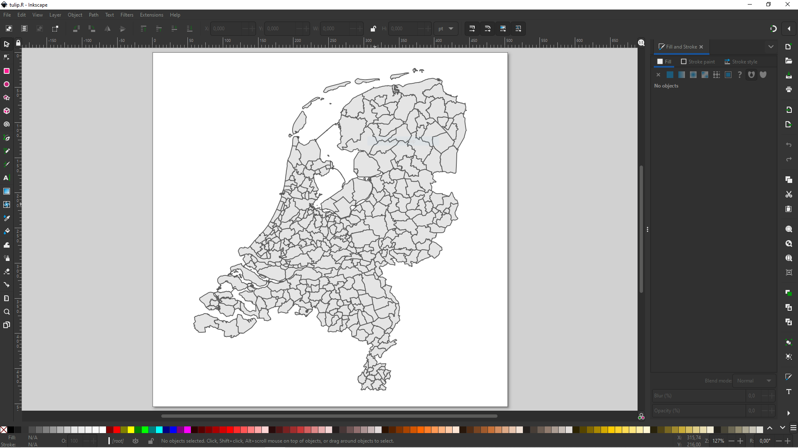

# impoRt
impoRt is an Inkscape extension for executing R scripts from Inkscape to represent the resulting R plot inside the Inkscape canvas.

# Requirements

Strictly R and Inkscape must be installed on the platform. 

# Extension set up

1. Make sure the `PATH` to` Rscript` is set in the Environment Variables of your system.

2. Files from `extensions` folder of this repository:

- `r_import.py` 

- `r_import.inx`

must be copied to the User Extensions directory which is listed at `Edit`>`Preferences`>`System` - `User Extensions:` in Inkscape.

3. Make sure R packages from examples are installed

# Rscripts

In order for the script to run correctly, it must meet the following convention:

```
#!/usr/bin/env Rscript
args = commandArgs(trailingOnly = TRUE)
# Your code starts here
....................
# Your code ends here
ggsave(filename = args[1] , plot = ...)

```

in place of dots you can type whatever you want.

# Why does it work?

After importing (or opening) R script with Inkscape: 


Inkscape builds command like:

`Rscript script.R output.svg` which is executed by the system. At that time your script creates `args` variable where keeps the name of the output. That name is next passed to `ggsave` and your `plot` is saved there. At the end Inkscape loads the output into canvas. Easy !

When using `Import` a popup will show:


# Examples

## Iris

In the `examples` folder you can find `iris.R` script with following content: 

```
#!/usr/bin/env Rscript
args = commandArgs(trailingOnly = TRUE)
# Your code starts here
library(tidyverse)

plot <- iris %>%
  ggplot() +
  aes(x = Petal.Length,
      y = Petal.Width,
      colour = Species) +
  geom_point()

# Your code ends here
ggsave(filename = args[1] , plot = plot)
```

after import you should see in Inkscape:


## Rose

Another example, script `rose.R`:

```
#!/usr/bin/env Rscript
args = commandArgs(trailingOnly = TRUE)
# Your code starts here
library(tidyverse)
library(sf)

st_rose = function(x) {
  p = x %>% select(p) %>% pull()
  q = x %>% select(q) %>% pull()
  n = x %>% select(n) %>% pull()
  tibble(theta = seq(0, n * pi, length.out = 100)) %>%
    mutate(r = 1 * cos(p / q * theta)) %>%
    mutate(x = r * cos(theta)) %>%
    mutate(y = r * sin(theta)) %>%
    select(x, y) %>%
    as.matrix() %>%
    list() %>%
    st_multilinestring() %>%
    st_sfc()}

plot <- tibble(p = 3, q = 5) %>% 
  mutate(n = ifelse((p * q) %% 2 == 0, 2 * q, 1 * q)) %>%
  st_rose() %>%
  ggplot() +
  geom_sf()

# Your code ends here
ggsave(filename = args[1] , plot = plot)

```

after open you should see in Inkscape:


The rose curve is well described at https://en.wikipedia.org/wiki/Rose_(mathematics) and using 'SIMPLE FEATURES' to build them is a bit extravagant. Truth :)

## Tulip

The last example from script `tulip.R` :

```
#!/usr/bin/env Rscript
args = commandArgs(trailingOnly = TRUE)
# Your code starts here
library(tidyverse)
library(sf)

plot <-
  "https://geodata.nationaalgeoregister.nl/cbsgebiedsindelingen/wfs?request=GetFeature&service=WFS&version=2.0.0&typeName=cbs_gemeente_2022_gegeneraliseerd&outputFormat=json" %>%
  st_read() %>%
  ggplot() +
  geom_sf() +
  theme_void()

# Your code ends here
ggsave(filename = args[1] , plot = plot)

```



## Flowers

This is rather advanced example, consider reading https://www.tidytextmining.com/ before giving up. Shortly, we read data from github, count words in flower names and plot most frequent 200 tokens so that more frequent tokens have bigger font size. Note that here I'm not specifying plot name, `ggsave` takes `last_plot()`.

```
#!/usr/bin/env Rscript
args = commandArgs(trailingOnly = TRUE)
# Your code starts here

if (!require("ggwordcloud"))
  install.packages("ggwordcloud")
if (!require("tidytext"))
  install.packages("tidytext")

library(tidyverse) # general meta package
library(ggwordcloud) # for world cloud
library(tidytext) # for NLP
"https://gist.githubusercontent.com/researchranks/ffe24c33df30e64f51271ddec83b4af6/raw/0e15dabe9b54611288cf92f93e1bfa288e150448/flower-and-plant-names.csv" %>%
  read_csv(col_names = FALSE) %>%
  mutate(linenumber = row_number()) %>%
  unnest_tokens(word, X1)  %>%
  count(word, sort = T) %>%
  top_n(200) %>%
  ggplot() +
  geom_text_wordcloud_area(aes(label = word, size = n)) +
  scale_size_area(max_size = 15)

# Your code ends here
ggsave(filename = args[1])

```


## Tree

This code comes from https://r-graph-gallery.com/334-basic-dendrogram-with-ggraph.html and shows that `ggraph` library also gives beautiful result in Inkscape.


# Extra


# Notes

- `ggsave` saves a ggplot (or other grid object) with sensible defaults so that can be used to produce SVG

- method `plot()` doesn't work

- R working directory is extensions directory. To read data from file you need to specify full path or change working directory with `setwd()`


- when using `reticulate` don't override `r` variable reserved for R environment

# References

https://inkscape.gitlab.io/extensions/documentation/tutorial/my-first-import-extension.html
